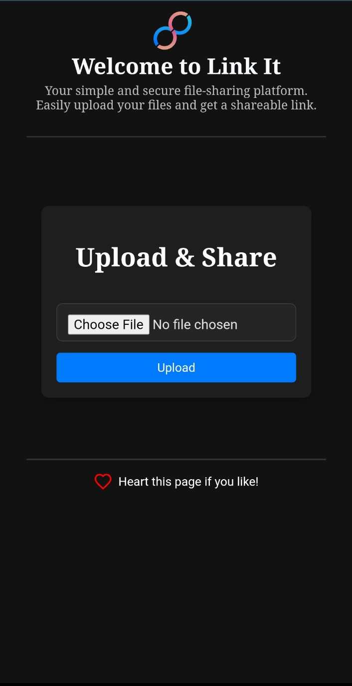
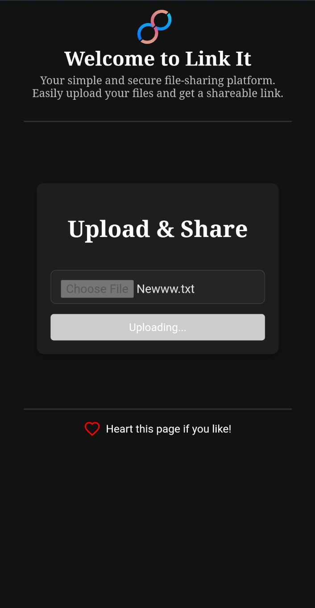
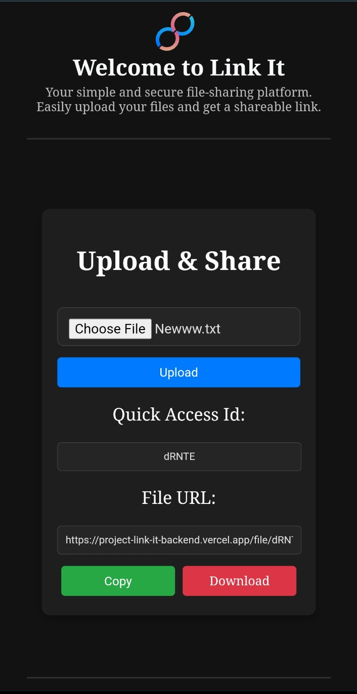
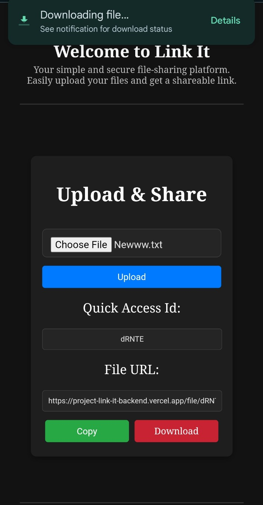
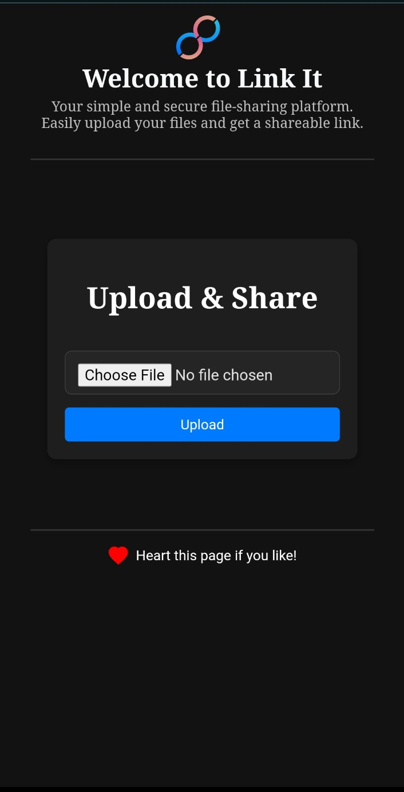

# Link It - File Sharing Platform

Link It is a simple and secure file-sharing platform that allows users to upload files and generate shareable links for easy access.

## Features
- Upload files securely.
- Generate a shareable link for each uploaded file.
- Copy the link to the clipboard with a single click.
- Download the file using the generated link.
- Like the page as a fun interaction.

## Tech Stack
- **Frontend:** React (with Vite)
- **Backend:** Node.js, Express, MongoDB (Atlas), Cloudinary

## Screenshots

   
   
   
   
  

## Usage
1. Select a file to upload.
2. Click the "Upload" button.
3. Copy the generated link or download the file.

## API Endpoints
### Upload File
**Endpoint:** `POST /upload`
- **Request:** FormData (file)
- **Response:** `{ fileId: "<file-id>" }`

### Get File
**Endpoint:** `GET /file/:id`
- **Response:** File download link

## Future Improvements
- User authentication.
- File expiration settings.
- File preview support.

